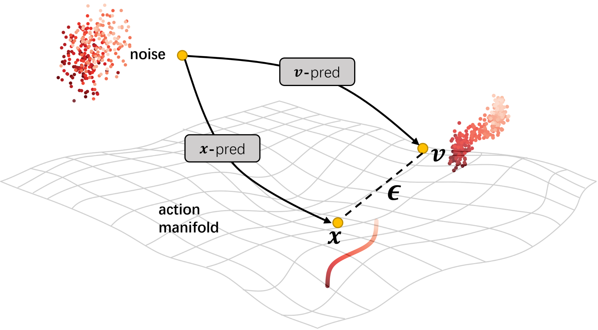

# 🤖minimind-VLA

A robot embodied intelligence vision-language-action model implemented based on [minimind-v](https://github.com/jingyaogong/minimind-v)
### The action expert module integrates three continuous action generation algorithms: epsilon-diffusion, v-pred(flow-matching), [x-pred](https://github.com/LTH14/JiT)


## Comparison of Modeling Capabilities of Three Action Prediction Modules

### Moons Dataset Comparison

Below are the comparison results of three action prediction algorithms on the Moons dataset:

| $\epsilon$(d=512) | $v$-pred(d=512) | $x$-pred(d=512)  |
|------------------------|-------------------------|-------------------------|
|  |  |  |

### Spiral Dataset Comparison

Below are the comparison results of three action prediction algorithms on the Spiral dataset:

| $\epsilon$(d=512) | $v$-pred(d=512) | $x$-pred(d=512)  |
|-------------------------|-------------------------|-------------------------|
|  |  |  |

### Robot Simulation Scenario


### minimind-vla Training


## File Description

1. **`dataset/vla_dataloader.py`**: VLA dataset loader that loads image, text, and action data from HDF5 files
2. **`trainer/post_train_vla.py`**: VLA model training script (with frozen vision encoder)
3. **`scripts/collect_franka_hdf5.py`**: Tool script for creating example HDF5 data files for Franka robot object grasping
4. **`test_post_train_vla.py`**: Script for testing the training process

## HDF5 Data Format

HDF5 files use an episode-based grouping structure. Each episode group contains the following datasets:

```
data/
├── episode_00000/
│   ├── rgb: Image data with shape `(num_frames, 224, 224, 3)`, data type `uint8`
│   ├── text: Text description, string type
│   ├── action: Action data with shape `(num_frames, action_chunk_size, action_dim)`, data type `float32`
│   └── robot_state: Robot state data with shape `(num_frames, robot_state_dim)`, data type `float32`
├── episode_00001/
│   ├── ...
```

- **`rgb`**: Image sequence for each episode
- **`text`**: Text description for each episode
- **`action`**: Action sequence for each episode
- **`robot_state`**: Robot state sequence for each episode (8 dimensions: 7 robot arm joint angles + 1 gripper value)

**Note**: According to previous modifications, the data loader now supports loading data from episode groups, and robot state information is required for normal training.

### Creating Example Data

```bash
python scripts\collect_franka_hdf5.py --gui  --episode 10
```

## Training the VLA Model

### Basic Training Command

```
modelscope download --model openai-mirror/clip-vit-base-patch16 ----local_dir ./model/vision_model/clip-vit-base-patch16
```

```bash
python trainer/post_train_vla.py --data_path ./dataset/franka_pick_dataset.hdf5 --epochs 20  --batch_size 64  --learning_rate 1e-3  --action_dim 8 --robot_state_dim 8  --action_chunk_size 100 --use_swanlab  --swanlab_project MiniMind-VLA
```

### Main Parameter Explanation

#### Basic Parameters
- `--data_path`: Path to the HDF5 data file
- `--epochs`: Number of training epochs
- `--batch_size`: Batch size
- `--learning_rate`: Learning rate
- `--device`: Training device (auto-detected by default)

#### Model Parameters
- `--hidden_size`: Hidden layer dimension (default 512)
- `--num_hidden_layers`: Number of hidden layers (default 8)
- `--max_seq_len`: Maximum sequence length (default 1536)
- `--use_moe`: Whether to use MoE architecture (0=no, 1=yes)

#### VLA-Specific Parameters
- `--action_dim`: Action dimension (default 8, e.g., 7DOF arm + gripper)
- `--action_chunk_size`: Action chunk size (default 100)
- `--action_hidden_size`: Hidden layer size for the action module (default 256)
- `--action_loss_weight`: Weight for action loss (default 1.0)
- `--robot_state_dim`: Robot state dimension (default 8, including 7 robot arm joint angles and 1 gripper value)

#### Training Parameters
- `--accumulation_steps`: Gradient accumulation steps (default 1)
- `--grad_clip`: Gradient clipping threshold (default 1.0)
- `--log_interval`: Logging interval (default 50)
- `--save_interval`: Model saving interval (default 500)

#### Pre-trained Weights
- `--from_weight`: Which weight to train based on (default 'pretrain_vlm', set to 'none' to not load weights)
- `--from_resume`: Whether to automatically detect and resume training (0=no, 1=yes)

#### SwanLab Recording
- `--use_swanlab`: Enable SwanLab recording
- `--swanlab_project`: SwanLab project name (default 'MiniMind-VLA')
