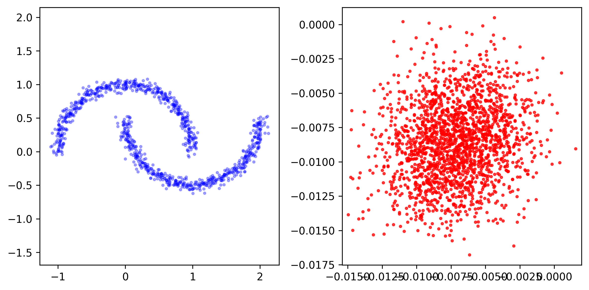
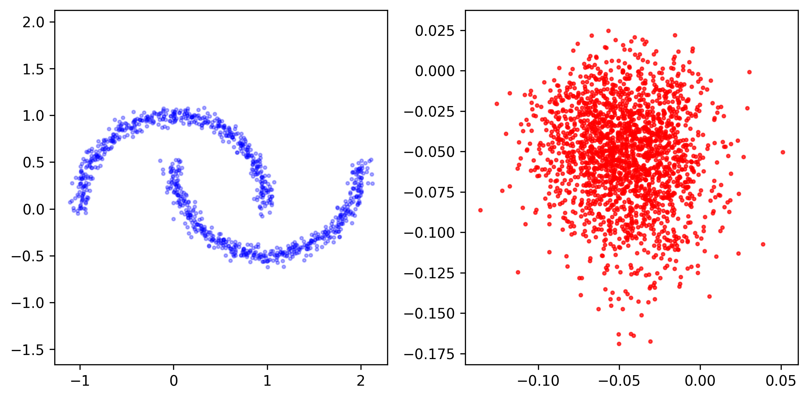
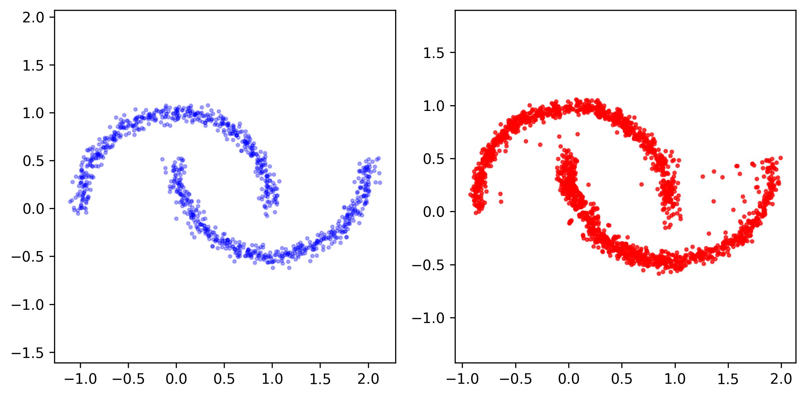
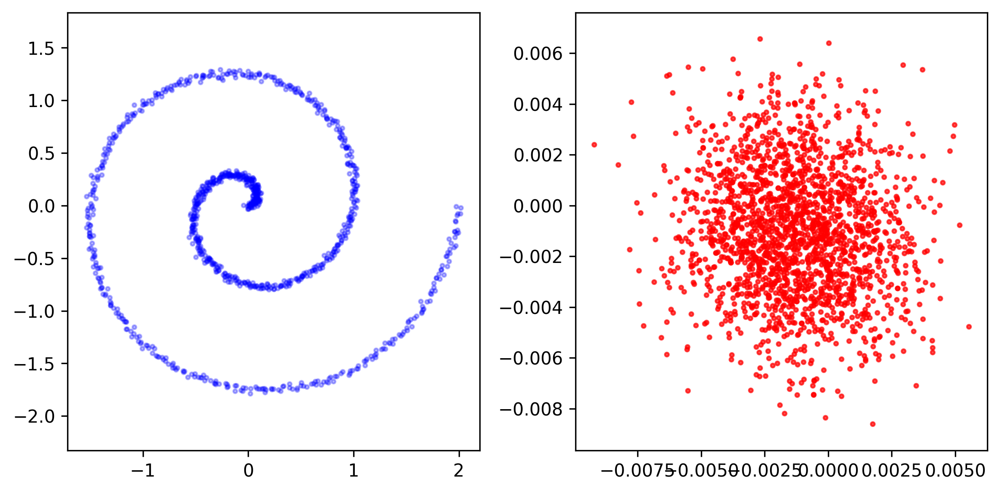
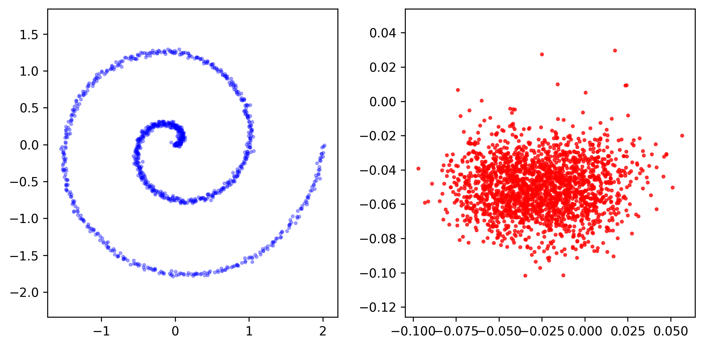
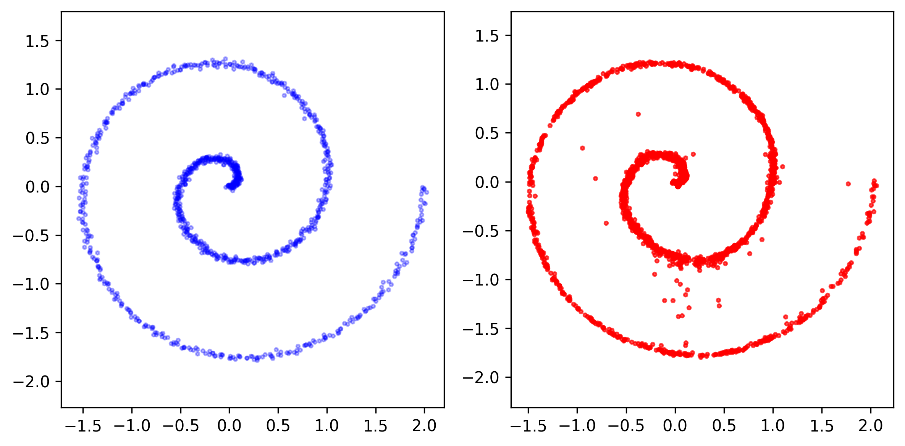
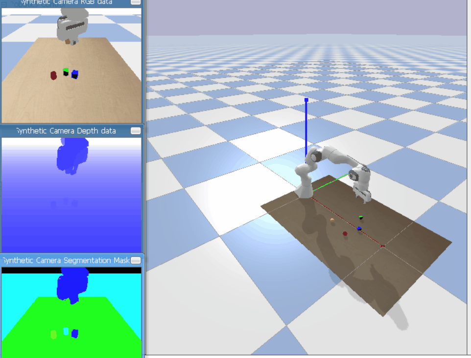
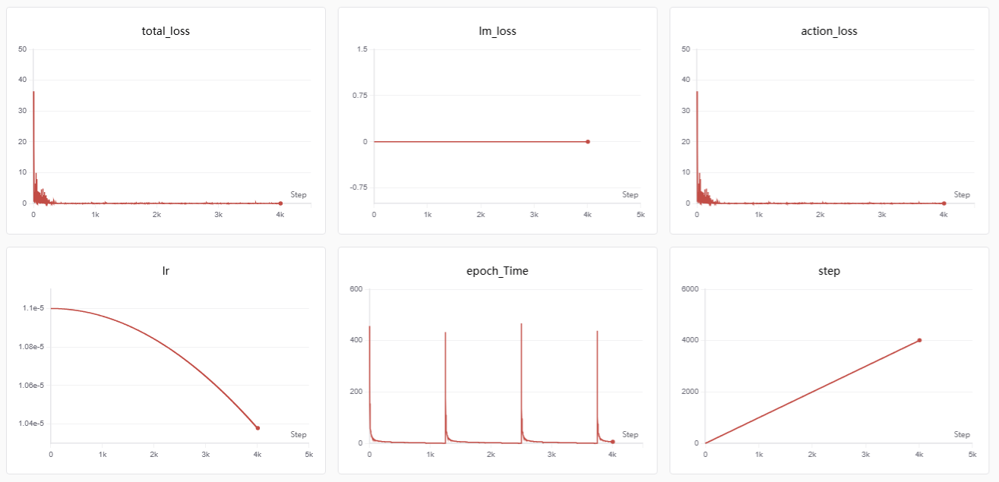

# VLA 模型训练指南

基于minimind-v实现的机器人具身智能vision languange action模型
action expert部分实现了三种算法，$\epsilon$(diffusion)、$v$-pred(flow-matching)、 [$x$-pred](https://github.com/LTH14/JiT)

## 三种动作预测模块建模能力对比

### Moons 数据集对比

以下是在Moons数据集上三种动作预测算法的对比结果：

| $\epsilon$(d=512) | $v$-pred(d=512) | $x$-pred(d=512)  |
|------------------------|-------------------------|-------------------------|
|  |  |  |

### Spiral 数据集对比

以下是在Spiral数据集上三种动作预测算法的对比结果：

| $\epsilon$(d=512) | $v$-pred(d=512) | $x$-pred(d=512)  |
|-------------------------|-------------------------|-------------------------|
|  |  |  |

### 机器人仿真场景



### minimind-vla 训练



## 文件说明

1. **`dataset/vla_dataloader.py`**: VLA 数据集加载器，从 HDF5 文件加载图像、文本和动作数据
2. **`trainer/post_train_vla.py`**: VLA 模型训练脚本（固定视觉编码器）
3. **`scripts/collect_franka_hdf5.py`**: 创建示例 HDF5 数据文件的工具脚本，franka 抓取物体
4. **`test_post_train_vla.py`**: 测试训练流程的脚本

## HDF5 数据格式

HDF5 文件采用episode分组结构，每个episode组包含以下数据集：

```
data/
├── episode_00000/
│   ├── rgb: 图像数据，形状为 `(num_frames, 224, 224, 3)`，数据类型为 `uint8`
│   ├── text: 文本描述，字符串类型
│   ├── action: 动作数据，形状为 `(num_frames, action_chunk_size, action_dim)`，数据类型为 `float32`
│   └── robot_state: 机器人状态数据，形状为 `(num_frames, robot_state_dim)`，数据类型为 `float32`
├── episode_00001/
│   ├── ...
```

- **`rgb`**: 每个episode的图像序列
- **`text`**: 每个episode的文本描述
- **`action`**: 每个episode的动作序列
- **`robot_state`**: 每个episode的机器人状态序列（8维：7个机械臂关节角度 + 1个夹爪值）

**注意**：根据之前的修改，数据加载器现在支持从episode组中加载数据，并且必须包含机器人状态信息才能正常训练。

### 创建示例数据

```bash
python scripts\collect_franka_hdf5.py --gui  --episode 10
```

## 训练 VLA 模型

### 基本训练命令

```bash
python trainer/post_train_vla.py --data_path ./dataset/franka_pick_dataset.hdf5 --epochs 20  --batch_size 64  --learning_rate 1e-3  --action_dim 8 --robot_state_dim 8  --action_chunk_size 100 --use_swanlab  --swanlab_project MiniMind-VLA
```


### 主要参数说明

#### 基本参数
- `--data_path`: HDF5 数据文件路径
- `--epochs`: 训练轮数
- `--batch_size`: 批次大小
- `--learning_rate`: 学习率
- `--device`: 训练设备（默认自动检测）

#### 模型参数
- `--hidden_size`: 隐藏层维度（默认 512）
- `--num_hidden_layers`: 隐藏层数量（默认 8）
- `--max_seq_len`: 最大序列长度（默认 1536）
- `--use_moe`: 是否使用 MoE 架构（0=否，1=是）

#### VLA 特定参数
- `--action_dim`: 动作维度（默认 8，例如：7DOF机械臂 + gripper）
- `--action_chunk_size`: action chunk 大小（默认 100）
- `--action_hidden_size`: action 模块隐藏层大小（默认 256）
- `--action_loss_weight`: action 损失权重（默认 1.0）
- `--robot_state_dim`: 机器人状态维度（默认 8，包括7个机械臂关节角度和1个夹爪值）

#### 训练参数
- `--accumulation_steps`: 梯度累积步数（默认 1）
- `--grad_clip`: 梯度裁剪阈值（默认 1.0）
- `--log_interval`: 日志打印间隔（默认 50）
- `--save_interval`: 模型保存间隔（默认 500）

#### 预训练权重
- `--from_weight`: 基于哪个权重训练（默认 'pretrain_vlm'，设置为 'none' 则不加载权重）
- `--from_resume`: 是否自动检测并续训（0=否，1=是）

#### SwanLab 记录
- `--use_swanlab`: 启用 SwanLab 记录
- `--swanlab_project`: SwanLab 项目名（默认 'MiniMind-VLA'）

